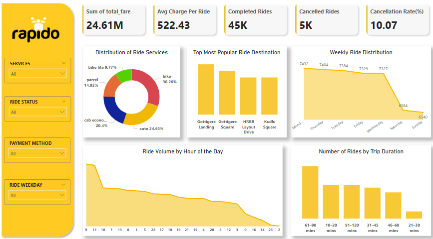

# Rapido-Ride-Services-Analysis

**📊 Project Overview**
This project presents a detailed Power BI dashboard analyzing 50,000+ Rapido ride records in Bangalore over a two-month period. The dataset covers multiple ride types, durations, distances, fares, and payment methods. The goal is to uncover trends in urban mobility, payment behavior, and ride performance.

**📊Dashboard Preview""

**🧾 Dataset Details**

https://www.kaggle.com/datasets/vishaldeoprasad/bangalore-rapido-ride-services-dataset
Size: 50,000 rows, 13 columns

**Features:**

- Ride service type (bike, auto, cab, parcel, etc.)
- Date & time of rides
- Source & destination locations
- Ride duration, distance, and fare breakdown
- Payment methods
- Ride status (completed/cancelled)

**📌 Key KPIs & Visuals**

- Ride Service Distribution – Service-wise share of total rides
- Weekly & Hourly Ride Trends – Understand peak usage periods
- Cancellation Insights – % of rides cancelled and their distribution
- Payment Method Usage – Popularity of GPay, Paytm, Amazon Pay, etc.
- Popular Destinations – Top drop-off points in the city
- Duration Group Analysis – Ride count across various duration buckets

**🛠 Tools Used**

- Power BI Desktop
- Power Query Editor (for data cleaning and transformation)
- DAX (for calculated columns and measures)

**💡 Insights Extracted**

- Most rides are completed successfully, with <10% cancellation.
- GPay, Paytm, and Amazon Pay are equally used among completed rides.
- Majority of rides fall within 60-90 minutes.
- Peak ride activity occurs during morning hours.
